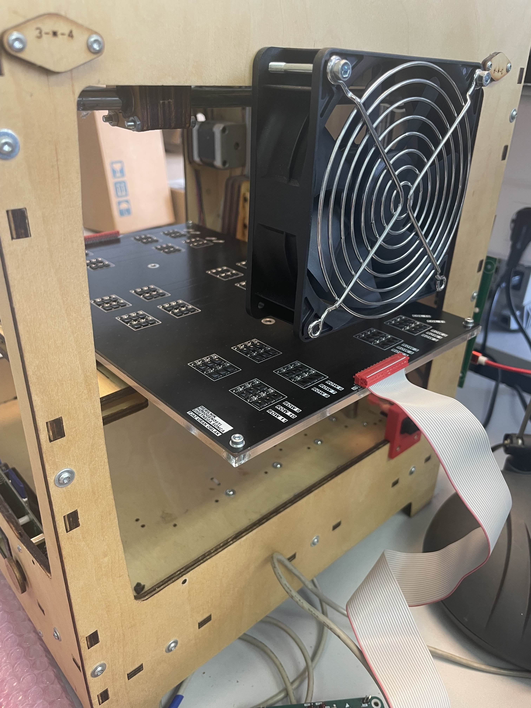
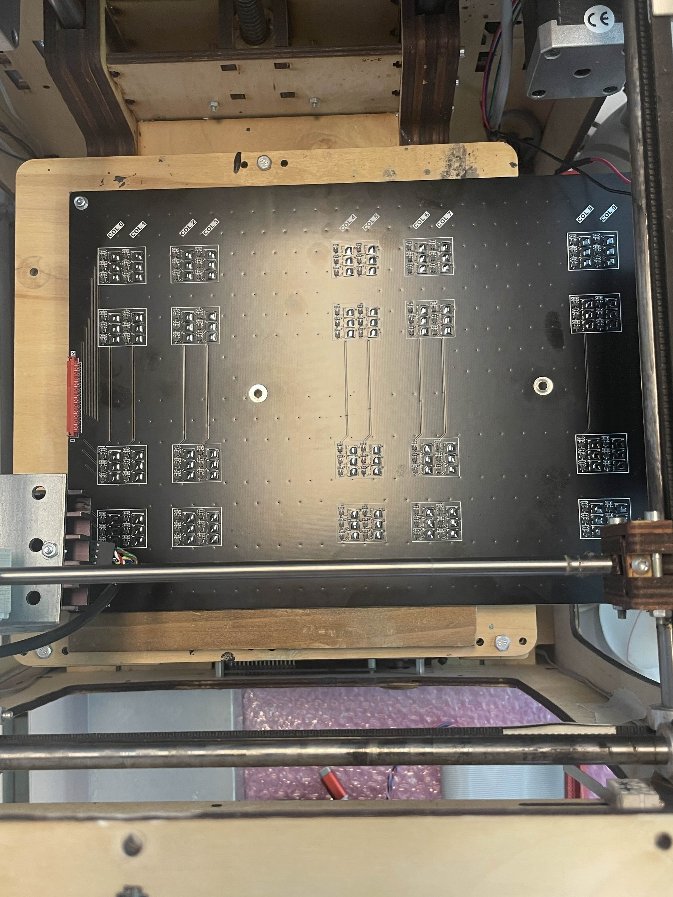
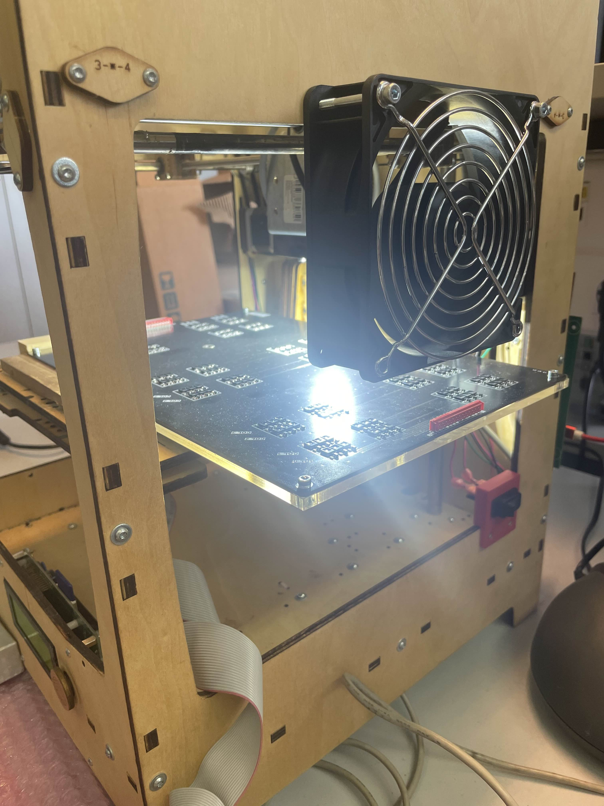
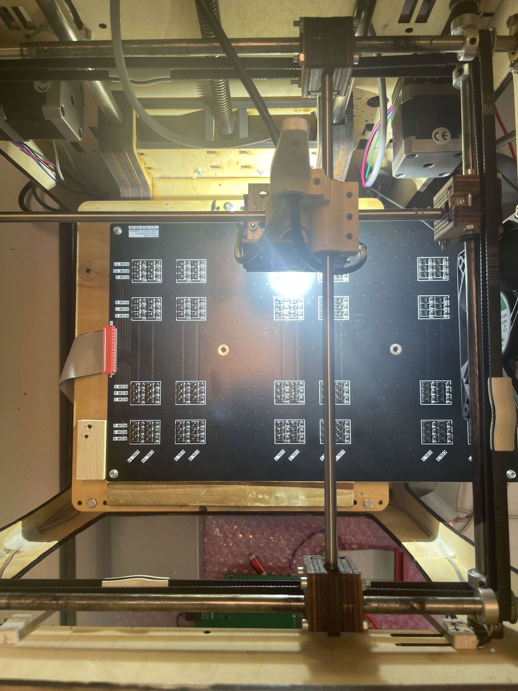

# SunCaliFW-Python
 System for measuring homogeneity of artificial sun - Python scripts

 LED module should be set to 100% illumination because Z distance of 3D printer is hard coded to one sun intensity.
 Command for led module: -a_l[100] (set illumination to 100%)
                         -a_l[0] (set illumination to 0%)

Start of Calibration:

After half of the calibration is complete turn the circuit around like shown in the image below. Do not change the connector side!

When the calibration is done do the validation the same way as you did the caliration, do not change the START and CONTINUE orientations!

To check printer height take a meter and measure like it is shown in the picture below. The height should be around 25.8 cm from the printer top panel.

For any questions contact me on my email: brunocernak1@gmail.com