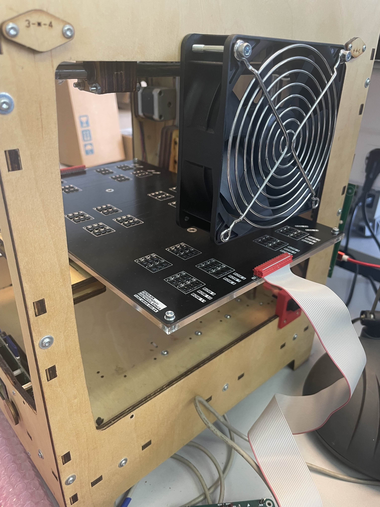
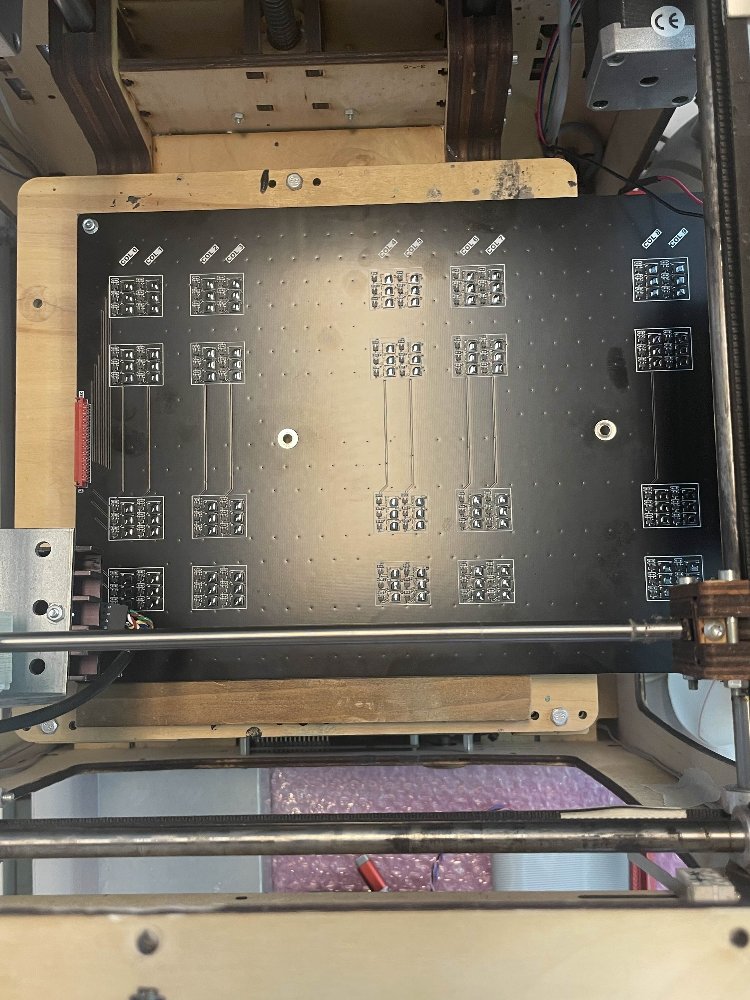
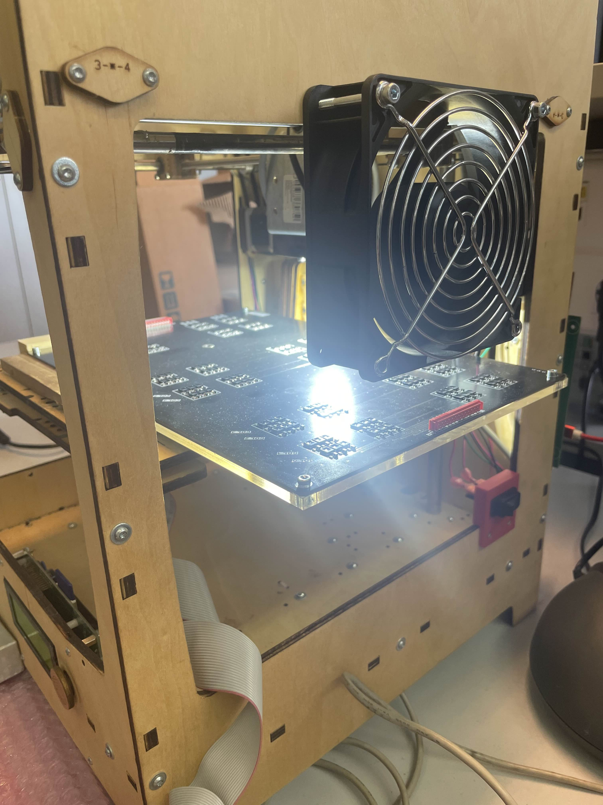
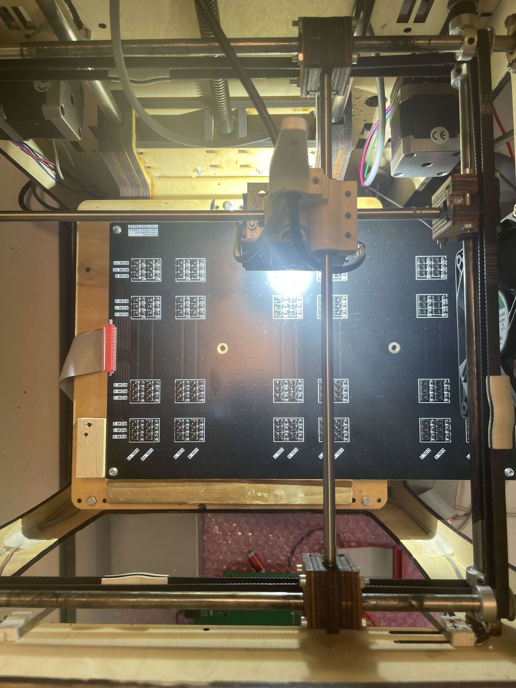
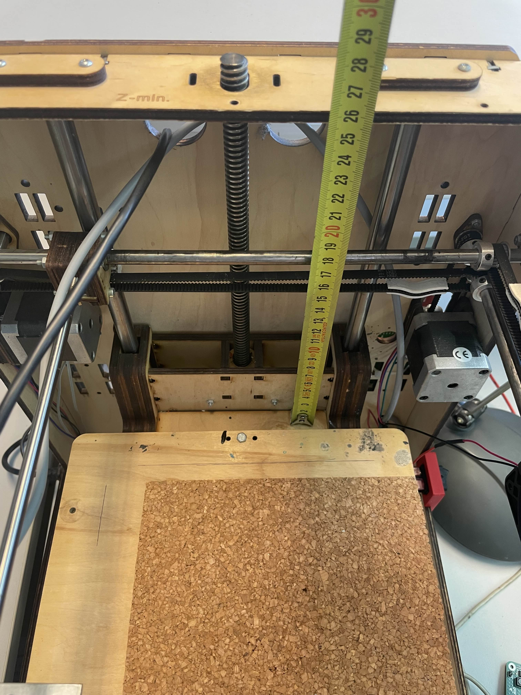

# SunCaliFW-Python
System for measuring homogeneity of artificial sun - Python scripts
## Setup
LED module should be set to 100% illumination because Z distance of 3D printer is hard coded to one sun intensity.
Command for led module: 
-a_l[100] (set illumination to 100%)
-a_l[0] (set illumination to 0%)
This is already take care of in LabVIEW UI.
## Start of Calibration
When starting the calibration the most important part is the photodiode array orientation. The array should be orientated like the pictures below and be vary of the side where the connector is connected. To run the program there is a UI in LabVIEW in the "LabVIEW_UI" folder. When using the UI it provides instructions and information messages. Also turn the fan ON, the LED module gets hot really fast and loses stability.

After half of the calibration is complete turn the circuit around like shown in the image below. Do not change the connector side!

When the calibration is done do the validation the same way as you did the calibration, do not change the START and CONTINUE orientations!
## Debugging
If values are not the same as the example already done, check the printer platform height. Take a meter and measure the distance, like it is shown in the picture below. The height should be around 25.8 cm from the printer top panel to the lower platform.

If wrong values still persist, check the jumper positions on the measurement unit. The right positions are in the [PCB_jumper_positions](Images/PCB_jumper_positions) folder.
For any questions contact me on my email: brunocernak1@gmail.com